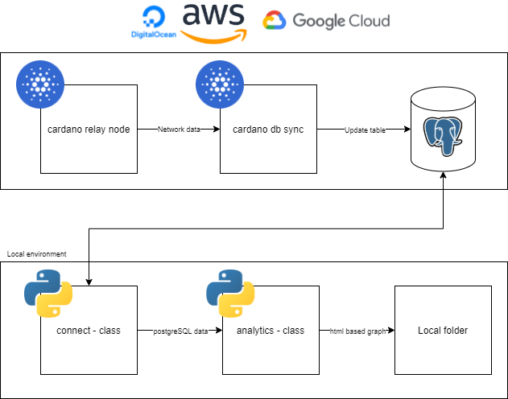

# cardano-analytics
 Repo containing the connection to a cardano-db-sync instance. 
 
# How to:
 Configure the 'setup-template.json' file with the IP of the instance you wish to connect to and the postgreSQL user and the password configured on the cardano-db-sync instance. When properly configure, rename the file 'setup.json' and you should be good to go!
 
# Overall structure

# How to setup cardano db sync
This is handled in this blok post on our website:
(https://www.midnort.com/post/how-to-setup-cardano-db-sync)
